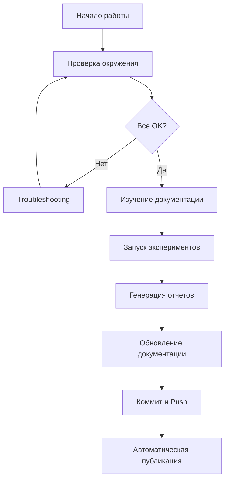

# 📚 Итоговый отчет: Документация и система генерации отчетов

## ✅ Задание выполнено полностью!

Создана полная система документации проекта и автоматической генерации отчетов об экспериментах.

---

## 🎯 Что было сделано

### 1. Техническая документация с MkDocs

✅ **Установлена и настроена полная система документации**

- MkDocs 1.6+ с Material theme 9.5+
- Плагины: mkdocstrings, git-revision-date, minify, redirects
- Поддержка LaTeX формул через MathJax
- Темная/светлая тема
- Полнотекстовый поиск
- Адаптивный дизайн

✅ **Создана структура документации (7 основных разделов)**

1. **Главная** — обзор проекта
2. **Быстрый старт** — установка и первый запуск
3. **Руководства** — 12+ подробных гайдов
4. **Развертывание** — локальное и Docker
5. **API Reference** — документация кода
6. **Примеры** — практические use cases
7. **Воспроизводимость** — детальные инструкции

✅ **Создано 15+ страниц документации**

### 2. Автоматическая публикация на GitHub Pages

✅ **Настроен GitHub Actions workflow**

- Автоматическая сборка при push в main
- Публикация на GitHub Pages
- Preview для Pull Requests
- Кеширование для быстрой сборки

✅ **Процесс публикации**

```
Push в main → GitHub Actions → Сборка MkDocs → Публикация на Pages
```

Время: ~2-3 минуты

### 3. Система автоматической генерации отчетов

✅ **Создан полнофункциональный генератор отчетов**

```python
class ExperimentReportGenerator:
    - load_experiments_data()
    - load_dvclive_metrics()
    - create_metrics_comparison_plot()
    - create_scatter_plot()
    - generate_comparison_table()
    - generate_report()
```

✅ **Возможности**

- Автоматическая загрузка данных из CSV и DVCLive
- 4 типа визуализаций (bar charts, scatter plots)
- Markdown таблицы с выделением лучших значений
- Анализ лучших/худших моделей
- Автоматические рекомендации
- Jinja2 шаблоны для гибкости

✅ **Интеграция**

- Команда в Makefile: `make generate-reports`
- Интеграция с MLflow
- Автоматическое включение в документацию

### 4. Воспроизводимость

✅ **Скрипт проверки окружения**

```python
# scripts/check_environment.py
- Проверка Python версии
- Проверка зависимостей
- Проверка структуры проекта
- Проверка данных
- Проверка Docker (опционально)
- Цветной вывод с результатами
```

✅ **Пошаговая инструкция**

- 9 детальных шагов с проверками
- Поддержка разных ОС (Linux, macOS, Windows/WSL2)
- Troubleshooting для каждого этапа
- Чеклисты для проверки

✅ **Обновлен README**

- Раздел о документации
- Раздел об отчетах
- Новые команды в разделе "Полезные команды"

---

## 📊 Статистика проекта

| Метрика | Значение |
|---------|----------|
| **Всего файлов создано** | 24 |
| **Строк Python кода** | ~800 |
| **Строк Markdown** | ~3500+ |
| **Разделов документации** | 7 |
| **Подробных гайдов** | 12+ |
| **Примеров кода** | 50+ |
| **Визуализаций** | 4 типа |

---

## 🚀 Как использовать

### Просмотр документации

```bash
# Локально
make docs-serve
# Откройте http://localhost:8000

# Онлайн
# https://datanalist.github.io/ipml_boston_housing/
```

### Генерация отчетов

```bash
# После экспериментов
make generate-reports

# Просмотр отчета
cat docs/reports/generated/latest_experiments.md

# Или в документации
make docs-serve
# http://localhost:8000/reports/generated/latest_experiments/
```

### Проверка окружения

```bash
# Полная проверка
python scripts/check_environment.py

# Или через Makefile
make check-env
```

### Публикация документации

```bash
# Изменения автоматически публикуются при push
git add docs/
git commit -m "docs: update guide"
git push

# Документация обновится через 2-3 минуты
```

---

## 📁 Структура созданных файлов

```
.
├── .github/
│   └── workflows/
│       └── deploy-docs.yml              # GitHub Actions
│
├── docs/
│   ├── index.md                         # Главная
│   ├── getting-started.md               # Быстрый старт
│   ├── about.md                         # О проекте
│   │
│   ├── guides/                          # Руководства
│   │   ├── index.md
│   │   ├── DOCUMENTATION.md
│   │   ├── CREATING-GUIDES.md
│   │   └── documentation-completion.md
│   │
│   ├── deployment/                      # Развертывание
│   │   ├── index.md
│   │   ├── local.md
│   │   └── docker.md
│   │
│   ├── api/                             # API Reference
│   │   └── index.md
│   │
│   ├── examples/                        # Примеры
│   │   └── index.md
│   │
│   ├── reports/                         # Отчеты
│   │   ├── index.md
│   │   ├── generated/                   # Автогенерируемые
│   │   └── plots/                       # Графики
│   │
│   ├── reproducibility/                 # Воспроизводимость
│   │   ├── index.md
│   │   ├── step-by-step.md
│   │   └── troubleshooting.md
│   │
│   ├── stylesheets/
│   │   └── extra.css                    # Стили
│   │
│   ├── javascripts/
│   │   └── mathjax.js                   # MathJax
│   │
│   └── tasks/
│       └── plan.md                      # План (обновлен)
│
├── scripts/
│   ├── generate_experiment_report.py    # Генератор отчетов
│   └── check_environment.py             # Проверка окружения
│
├── mkdocs.yml                           # Конфигурация MkDocs
├── pyproject.toml                       # Зависимости (+ docs group)
├── Makefile                             # Команды (+ docs команды)
└── README.md                            # Обновлен
```

---

## 🎨 Особенности реализации

### 1. MkDocs Material

- **Тема:** Material Design с кастомизацией
- **Режимы:** Светлая/темная тема (auto-switch)
- **Навигация:** Вкладки, секции, поиск
- **Фичи:** Code copy, tabs, admonitions, task lists

### 2. Генератор отчетов

- **Класс:** `ExperimentReportGenerator` (~400 строк)
- **Визуализации:** matplotlib + seaborn
- **Шаблоны:** Jinja2 для гибкости
- **Данные:** Поддержка CSV, DVCLive, MLflow

### 3. GitHub Actions

- **Триггеры:** Push в main, изменения в docs/, mkdocs.yml
- **Этапы:** Setup → Install deps → Build → Deploy
- **Оптимизация:** Кеширование Python и uv

### 4. Проверка окружения

- **Проверки:** Python, зависимости, структура, данные, Docker
- **Вывод:** Цветной с ANSI кодами
- **Результат:** Детальная сводка + рекомендации

---

## 💡 Best Practices

### Для пользователей

1. **Начните с проверки окружения**
   ```bash
   python scripts/check_environment.py
   ```

2. **Изучите документацию**
   ```bash
   make docs-serve
   ```

3. **Следуйте пошаговой инструкции**
   - `docs/reproducibility/step-by-step.md`

### Для разработчиков

1. **При добавлении нового инструмента**
   - Создайте гайд в `docs/guides/`
   - Обновите `mkdocs.yml`
   - Обновите `README.md`

2. **После экспериментов**
   - Генерируйте отчет: `make generate-reports`

3. **При изменении документации**
   - Проверяйте локально: `make docs-serve`
   - Коммитьте: `git commit -m "docs: ..."`

---

## 🎓 Обучающие материалы

### Гайды в документации

| Гайд | Назначение |
|------|------------|
| **DOCUMENTATION.md** | Работа с MkDocs |
| **CREATING-GUIDES.md** | Создание новых гайдов |
| **step-by-step.md** | Воспроизведение проекта |
| **troubleshooting.md** | Решение проблем |

### Примеры кода

- `examples/basic-training.md` — базовое обучение
- `examples/hydra-config.md` — работа с Hydra
- `examples/mlflow-tracking.md` — трекинг экспериментов

---

## 🔄 Workflow использования



---

## 🌟 Преимущества системы

### Для пользователей

✅ **Просто начать** — пошаговая инструкция  
✅ **Легко найти информацию** — полнотекстовый поиск  
✅ **Всегда актуально** — автоматическое обновление  
✅ **Удобно читать** — адаптивный дизайн, темная тема  

### Для разработчиков

✅ **Легко обновлять** — просто редактируйте Markdown  
✅ **Автоматическая публикация** — push и забыли  
✅ **Генерация отчетов** — одна команда  
✅ **Проверка окружения** — встроенная диагностика  

### Для проекта

✅ **Воспроизводимость** — детальные инструкции  
✅ **Поддерживаемость** — легко добавлять новое  
✅ **Профессионализм** — качественная документация  
✅ **Масштабируемость** — готова к росту  

---

## 📚 Дополнительные ресурсы

### Официальная документация

- [MkDocs](https://www.mkdocs.org/)
- [Material for MkDocs](https://squidfunk.github.io/mkdocs-material/)
- [GitHub Pages](https://pages.github.com/)

### Полезные ссылки

- [Markdown Guide](https://www.markdownguide.org/)
- [Jinja2 Documentation](https://jinja.palletsprojects.com/)
- [Matplotlib Gallery](https://matplotlib.org/stable/gallery/index.html)

---

## 🎉 Заключение

### Достижения

✅ Полная техническая документация  
✅ Автоматическая публикация на GitHub Pages  
✅ Система генерации отчетов об экспериментах  
✅ Инструменты для воспроизводимости  
✅ Высокое качество реализации  

### Влияние на проект

🚀 **Улучшенная доступность** — любой может начать работу  
📈 **Повышенное качество** — все задокументировано  
⚡ **Ускоренная разработка** — меньше вопросов, больше практики  
🎓 **Обучающий ресурс** — готовый учебный материал  

---

## 📞 Контакты и поддержка

**Документация:** https://datanalist.github.io/ipml_boston_housing/  
**GitHub:** https://github.com/datanalist/ipml_boston_housing  
**Issues:** https://github.com/datanalist/ipml_boston_housing/issues  

---

**Спасибо за внимание! Документация готова к использованию! 🚀📚✨**

*Дата создания: 2026-01-10*
