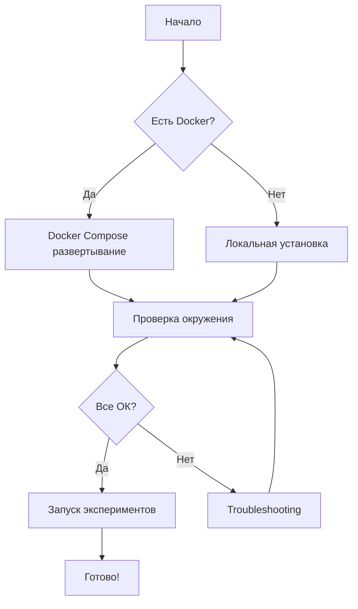

# Развертывание

Этот раздел содержит подробные инструкции по развертыванию проекта в различных окружениях.

---

## 📋 Обзор

Проект поддерживает несколько вариантов развертывания:

| Вариант | Сложность | Использование | Рекомендуется для |
|---------|-----------|---------------|-------------------|
| **Локальная установка** | ⭐ Легко | Разработка, тестирование | Начинающих, быстрого старта |
| **Docker Compose** | ⭐⭐ Средне | Производство, полная инфраструктура | Полноценных экспериментов |

---

## 🎯 Выбор варианта развертывания

### Локальная установка

**Когда использовать:**
- Быстрая разработка и тестирование
- Изучение кода
- Ограниченные ресурсы

**Преимущества:**
- ✅ Быстрая установка
- ✅ Простая отладка
- ✅ Минимальные требования

**Недостатки:**
- ❌ Требуется ручная настройка зависимостей
- ❌ Нет изоляции окружения
- ❌ Ограниченная инфраструктура

[Перейти к инструкции →](local.md)

---

### Docker Compose

**Когда использовать:**
- Полный стек сервисов (Airflow + MLflow + MinIO)
- Воспроизводимое окружение
- Производственное развертывание

**Преимущества:**
- ✅ Полная изоляция
- ✅ Все сервисы из коробки
- ✅ Легкое масштабирование
- ✅ Воспроизводимость

**Недостатки:**
- ❌ Требует больше ресурсов (минимум 8 GB RAM)
- ❌ Дольше стартует
- ❌ Сложнее отладка

[Перейти к инструкции →](docker.md)

---

## 🔧 Проверка окружения

После установки используйте встроенный скрипт проверки:

```bash
python scripts/check_environment.py
```

Скрипт проверит:
- ✅ Версию Python
- ✅ Установленные зависимости
- ✅ Доступность сервисов (Docker)
- ✅ Доступность данных
- ✅ Конфигурации

Подробнее о проверке окружения см. в разделе [Воспроизводимость](../reproducibility/index.md).

---

## 🎓 Рекомендуемый процесс



### Пошаговый план

1. **Выберите вариант развертывания** (локальный или Docker)
2. **Следуйте инструкциям** из соответствующего раздела
3. **Проверьте окружение** с помощью `check_environment.py`
4. **Запустите первый эксперимент** для проверки

---

## 🆘 Помощь

Если возникли проблемы:

1. Проверьте [Troubleshooting](../reproducibility/troubleshooting.md)
2. Убедитесь в соответствии системным требованиям
3. Проверьте логи: `docker-compose logs` или логи в `outputs/`

---

## 📚 Связанные разделы

- [Быстрый старт](../getting-started.md) — минимальная установка для начала работы
- [Воспроизводимость](../reproducibility/index.md) — детальные инструкции
- [Docker инфраструктура](../guides/DOCKER.md) — подробности о Docker
