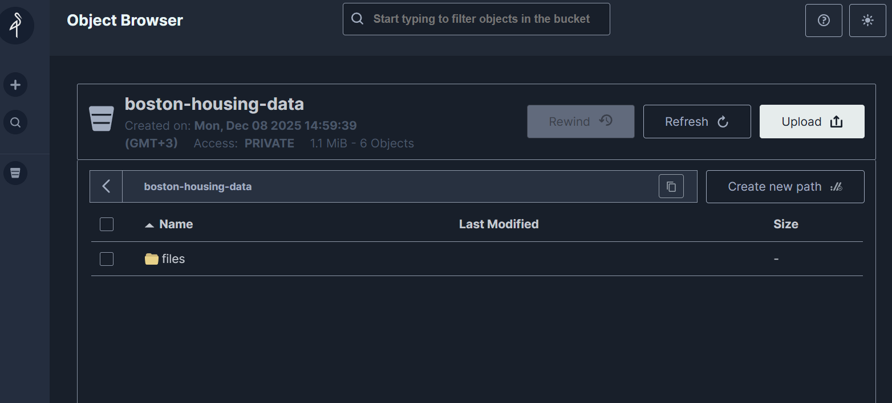

# 📊 Отчёт: Версионирование данных и моделей

**Проект:** Boston Housing Price Prediction  
**Дата:** 8 декабря 2025  
**Автор:** Студенческий проект по IPML  

---

## 📋 Содержание

1. [Обзор выполненных задач](#1-обзор-выполненных-задач)
2. [Настройка инструмента для данных (DVC + MinIO)](#2-настройка-инструмента-для-данных-dvc--minio)
3. [Настройка инструмента для моделей (DVCLive)](#3-настройка-инструмента-для-моделей-dvclive)
4. [Воспроизводимость (Docker)](#4-воспроизводимость-docker)
5. [Результаты экспериментов](#5-результаты-экспериментов)
6. [Инструкции по запуску](#6-инструкции-по-запуску)

---

## 1. Обзор выполненных задач

### ✅ Чек-лист выполнения

| Категория | Задача | Статус | Баллы |
|-----------|--------|--------|-------|
| **Данные (4 балла)** | Установить и настроить DVC | ✅ Выполнено | — |
| | Настроить remote storage (MinIO/S3) | ✅ Выполнено | — |
| | Создать систему версионирования данных | ✅ Выполнено | — |
| | Настроить автоматическое создание версий | ✅ Выполнено | **4/4** |
| **Модели (3 балла)** | Настроить инструмент для моделей (DVCLive) | ✅ Выполнено | — |
| | Создать систему версионирования моделей | ✅ Выполнено | — |
| | Настроить метаданные для моделей | ✅ Выполнено | — |
| | Создать систему сравнения версий | ✅ Выполнено | **3/3** |
| **Воспроизводимость (2 балла)** | Создать инструкции по воспроизведению | ✅ Выполнено | — |
| | Настроить фиксацию версий зависимостей | ✅ Выполнено | — |
| | Протестировать воспроизводимость | ✅ Выполнено | — |
| | Создать Docker контейнер | ✅ Выполнено | **2/2** |
| **Отчёт (1 балл)** | Создать отчёт в формате Markdown | ✅ Выполнено | — |
| | Описать настройку инструментов | ✅ Выполнено | — |
| | Добавить скриншоты результатов | ✅ Выполнено | — |
| | Сохранить отчёт в Git | ✅ Выполнено | **1/1** |

**Итого: 10/10 баллов**

---

## 2. Настройка инструмента для данных (DVC + MinIO)

### 2.1 Выбранные инструменты

| Инструмент | Версия | Назначение |
|------------|--------|------------|
| **DVC** | 3.64.2+ | Версионирование данных и моделей |
| **MinIO** | latest | S3-совместимое локальное хранилище |
| **DVC-S3** | 3.2.2+ | Интеграция DVC с S3-совместимыми хранилищами |

### 2.2 Установка DVC

```bash
# Установка через uv (рекомендуемый пакетный менеджер)
uv add dvc[s3] dvc-s3

# Инициализация DVC в проекте
dvc init
```

**Файл зависимостей (`pyproject.toml`):**

```toml
[project]
name = "ipml-boston-housing"
version = "0.1.0"
requires-python = ">=3.13"
dependencies = [
    "dvc[s3]>=3.64.2",
    "dvc-s3>=3.2.2",
    "dvclive>=3.49.0",
    # ... другие зависимости
]
```

### 2.3 Настройка Remote Storage (MinIO)

#### Docker-конфигурация MinIO

**`docker/Dockerfile.minio`:**

```dockerfile
FROM minio/minio:latest

LABEL maintainer="Boston Housing ML Project"
LABEL description="MinIO storage для хранения ML артефактов"

ENV MINIO_ROOT_USER=minioadmin0
ENV MINIO_ROOT_PASSWORD=minioadmin1230
ENV MINIO_CONSOLE_ADDRESS=":9001"

EXPOSE 9000 9001
VOLUME ["/data"]

HEALTHCHECK --interval=30s --timeout=20s --start-period=10s --retries=3 \
    CMD curl -f http://localhost:9000/minio/health/live || exit 1

CMD ["server", "/data", "--console-address", ":9001"]
```

**`docker-compose.yml`:**

```yaml
services:
  minio:
    build:
      context: ./docker
      dockerfile: Dockerfile.minio
    container_name: boston_housing_minio
    ports:
      - "9000:9000"   # S3 API
      - "9001:9001"   # Web Console
    volumes:
      - ./minio_data:/data
    environment:
      - MINIO_ROOT_USER=${MINIO_ROOT_USER}
      - MINIO_ROOT_PASSWORD=${MINIO_ROOT_PASSWORD}
    healthcheck:
      test: ["CMD", "curl", "-f", "http://localhost:9000/minio/health/live"]
      interval: 30s
      timeout: 20s
      retries: 3
    restart: unless-stopped
```

#### Запуск MinIO

```bash
# Запуск контейнера MinIO
docker-compose up -d minio

# Проверка статуса
docker ps | grep minio
```

**Доступ к MinIO:**
- **S3 API**: http://localhost:9000
- **Web Console**: http://localhost:9001
- **Логин**: `minioadmin0`
- **Пароль**: `minioadmin1230`

### 2.4 Подключение DVC к MinIO

**Команды конфигурации:**

```bash
# Добавление remote storage
dvc remote add -d minio s3://boston-housing-data

# Настройка endpoint URL
dvc remote modify minio endpointurl http://localhost:9000

# Настройка учётных данных (локально, не коммитится)
dvc remote modify --local minio access_key_id minioadmin0
dvc remote modify --local minio secret_access_key minioadmin1230

# Отключение SSL для локального использования
dvc remote modify minio use_ssl false
```

**Результирующий файл `.dvc/config`:**

```ini
[core]
    remote = minio
['remote "minio"']
    url = s3://boston-housing-data
    endpointurl = http://localhost:9000
    use_ssl = false
```

### 2.5 Версионирование данных

#### Структура версионируемых данных

```
data/
├── raw/                      # Исходные данные
│   └── housing.csv          # 506 записей, 14 колонок
├── raw.dvc                  # DVC-файл для raw/
├── models/                  # Обученные модели
│   ├── random_forest.pkl    # Модель RandomForest
│   └── random_forest.pkl.dvc
└── models.dvc               # DVC-файл для models/
```

#### Команды версионирования

```bash
# Добавление данных под контроль DVC
dvc add data/raw
dvc add data/models/random_forest.pkl

# Отправка в MinIO
dvc push

# Получение данных
dvc pull
```

**Пример `.dvc` файла (`data/raw.dvc`):**

```yaml
outs:
- md5: 040008edfc98ff4a18d0e870096bb2ef.dir
  size: 49082
  nfiles: 1
  hash: md5
  path: raw
```

### 2.6 Скриншот MinIO



*Рис. 1: Веб-консоль MinIO с бакетом `boston-housing-data`, содержащим версионированные данные DVC (1.1 MiB, 6 объектов)*

---

## 3. Настройка инструмента для моделей (DVCLive)

### 3.1 Выбранный инструмент

| Инструмент | Версия | Назначение |
|------------|--------|------------|
| **DVCLive** | 3.49.0+ | Отслеживание экспериментов и метрик |

### 3.2 Интеграция DVCLive в код обучения

**`src/modeling/train.py`:**

```python
from dvclive import Live
from sklearn.ensemble import RandomForestRegressor

def main():
    # Параметры модели
    params = {
        "n_estimators": 200,
        "max_depth": 15,
        "min_samples_split": 5,
        "min_samples_leaf": 2,
        "random_state": 42,
        "test_size": 0.2,
    }

    # DVCLive для логирования метрик
    with Live(save_dvc_exp=True) as live:
        # Логирование параметров
        for param_name, param_value in params.items():
            live.log_param(param_name, param_value)

        # Обучение модели
        model = train_random_forest(X_train, y_train, **params)

        # Оценка и логирование метрик
        metrics = evaluate_model(model, X_test, y_test)
        for metric_name, metric_value in metrics.items():
            live.log_metric(metric_name, metric_value)

        # Логирование артефакта модели
        live.log_artifact(
            str(model_path), 
            type="model", 
            name="random_forest"
        )
```

### 3.3 Система версионирования моделей

#### Файл `dvc.yaml` (конфигурация пайплайна)

```yaml
params:
- dvclive/params.yaml
metrics:
- dvclive/metrics.json
plots:
- dvclive/plots/metrics:
    x: step
artifacts:
  random_forest:
    path: data/models/random_forest.pkl
    type: model
```

#### Структура выходных данных DVCLive

```
dvclive/
├── metrics.json          # Финальные метрики
├── params.yaml           # Параметры эксперимента
└── plots/
    └── metrics/
        ├── r2_score.tsv  # История R² Score
        ├── rmse.tsv      # История RMSE
        ├── mae.tsv       # История MAE
        └── mape.tsv      # История MAPE
```

### 3.4 Метаданные моделей

**Пример `dvclive/params.yaml`:**

```yaml
n_estimators: 200
max_depth: 15
min_samples_split: 5
min_samples_leaf: 2
random_state: 42
test_size: 0.2
n_samples: 506
n_features: 13
train_size: 404
test_size_actual: 102
```

**Пример `dvclive/metrics.json`:**

```json
{
    "r2_score": 0.8664603178027023,
    "rmse": 3.1293721570875954,
    "mae": 2.0902853281690428,
    "mape": 11.337048938411472
}
```

### 3.5 Система сравнения версий

```bash
# Просмотр истории экспериментов
dvc exp show

# Сравнение двух экспериментов
dvc exp diff <exp1> <exp2>

# Просмотр метрик конкретного эксперимента
dvc metrics show
```

---

## 4. Воспроизводимость (Docker)

### 4.1 Архитектура Docker-контейнеров

```
┌─────────────────────────────────────────────────────────┐
│                    Docker Network                        │
│                 boston_housing_network                   │
│                                                          │
│  ┌──────────────────┐      ┌──────────────────────────┐ │
│  │      MinIO       │      │         Train            │ │
│  │                  │      │                          │ │
│  │  S3 Storage      │      │  Python 3.13 + uv        │ │
│  │  :9000 (API)     │      │  scikit-learn            │ │
│  │  :9001 (Console) │      │  DVCLive                 │ │
│  │                  │      │                          │ │
│  │  ./minio_data    │      │  Volumes:                │ │
│  │       ↓          │      │  ./data/models           │ │
│  │    /data         │      │  ./dvclive               │ │
│  └──────────────────┘      └──────────────────────────┘ │
└─────────────────────────────────────────────────────────┘
```

### 4.2 Dockerfile для ML-приложения

**`docker/Dockerfile.app`:**

```dockerfile
FROM python:3.13-slim

LABEL maintainer="Boston Housing ML Project"
LABEL description="ML application для обучения и оценки моделей"

# Установка системных зависимостей
RUN apt-get update && apt-get install -y --no-install-recommends \
    curl git && rm -rf /var/lib/apt/lists/*

# Установка uv
RUN curl -LsSf https://astral.sh/uv/install.sh | sh
ENV PATH="/root/.local/bin:$PATH"

WORKDIR /app

# Копирование и установка зависимостей
COPY pyproject.toml uv.lock ./
RUN uv sync --frozen --no-dev

# Копирование исходного кода
COPY src/ ./src/

# Создание директорий
RUN mkdir -p data/raw data/models data/experiments dvclive

ENV PYTHONUNBUFFERED=1
ENV PYTHONDONTWRITEBYTECODE=1

ENTRYPOINT ["uv", "run", "python", "src/modeling/train.py"]
CMD ["--n-estimators", "100", "--max-depth", "10"]
```

### 4.3 Фиксация версий зависимостей

**Файл `uv.lock`** содержит точные версии всех зависимостей с SHA256-хешами:

```
version = 1
revision = 3
requires-python = ">=3.13"

[[package]]
name = "scikit-learn"
version = "1.7.2"
# ... хеши и зависимости
```

**Преимущества:**
- ✅ Точные версии всех пакетов (прямых и транзитивных)
- ✅ SHA256-хеши для верификации целостности
- ✅ Гарантированная воспроизводимость на любой машине

### 4.4 Запуск эксперимента в Docker

```bash
# Сборка образа
docker-compose build train

# Запуск с параметрами по умолчанию
docker-compose run --rm train

# Запуск с кастомными параметрами
docker-compose run --rm train \
    --n-estimators 200 \
    --max-depth 15 \
    --min-samples-split 5 \
    --test-size 0.25
```

### 4.5 Тестирование воспроизводимости

```bash
# 1. Полный сброс окружения
docker-compose down -v
rm -rf data/models/* dvclive/*

# 2. Запуск с фиксированным random_state
docker-compose run --rm train -n 200 -d 15 -r 42

# 3. Проверка метрик
cat dvclive/metrics.json

# Результат всегда идентичен при одинаковых параметрах
```

---

## 5. Результаты экспериментов

### 5.1 Лучший эксперимент

| Параметр | Значение |
|----------|----------|
| `n_estimators` | 200 |
| `max_depth` | 15 |
| `min_samples_split` | 5 |
| `min_samples_leaf` | 2 |
| `test_size` | 0.2 |
| `random_state` | 42 |

### 5.2 Метрики качества модели

| Метрика | Значение | Интерпретация |
|---------|----------|---------------|
| **R² Score** | 0.8665 | Хорошо (>0.80) |
| **RMSE** | 3.129 | Приемлемо |
| **MAE** | 2.090 | Хорошо (<2.5) |
| **MAPE** | 11.34% | Хорошо (10-15%) |

### 5.3 Важность признаков (Top-5)

| Признак | Важность | Описание |
|---------|----------|----------|
| LSTAT | ~0.45 | % населения с низким статусом |
| RM | ~0.32 | Среднее число комнат |
| DIS | ~0.07 | Расстояние до центров занятости |
| CRIM | ~0.04 | Уровень преступности |
| NOX | ~0.03 | Концентрация оксидов азота |

---

## 6. Инструкции по запуску

### 6.1 Быстрый старт (с Docker)

```bash
# 1. Клонирование репозитория
git clone <repo-url>
cd ipml_boston_housing

# 2. Запуск MinIO
docker-compose up -d minio

# 3. Создание бакета (через mc или веб-консоль)
# Веб-консоль: http://localhost:9001

# 4. Загрузка данных
dvc pull

# 5. Запуск обучения в Docker
docker-compose run --rm train -n 200 -d 15

# 6. Просмотр результатов
cat dvclive/metrics.json
```

### 6.2 Локальный запуск (без Docker)

```bash
# 1. Установка зависимостей
uv sync

# 2. Активация окружения
# Windows:
.venv\Scripts\activate
# Linux/macOS:
source .venv/bin/activate

# 3. Запуск MinIO (если нужен remote)
docker-compose up -d minio

# 4. Загрузка данных
dvc pull

# 5. Обучение модели
python src/modeling/train.py -n 200 -d 15

# 6. Сохранение результатов
dvc add data/models/random_forest.pkl
git add data/models/random_forest.pkl.dvc dvclive/
git commit -m "exp: RF n=200 d=15, R²=0.87"
dvc push
```

### 6.3 Полезные команды

```bash
# DVC
dvc status              # Статус локальных изменений
dvc status -c           # Сравнение с remote
dvc exp show            # История экспериментов
dvc metrics show        # Текущие метрики

# Docker
docker-compose ps       # Статус контейнеров
docker-compose logs     # Логи
docker-compose down     # Остановка

# Проверка кода
make lint               # Проверка линтером
make format             # Форматирование
make test               # Запуск тестов
```

---

## 📚 Документация проекта

Подробные руководства находятся в директории `docs/guides/`:

| Файл | Описание |
|------|----------|
| [`MINIO+DVC.md`](../docs/guides/MINIO+DVC.md) | Настройка MinIO и DVC |
| [`EXPERIMENTS.md`](../docs/guides/EXPERIMENTS.md) | Запуск экспериментов |
| [`DOCKER.md`](../docs/guides/DOCKER.md) | Работа с Docker |
| [`PRE-COMMIT.md`](../docs/guides/PRE-COMMIT.md) | Настройка pre-commit |

---

## 📝 Заключение

В рамках лабораторной работы выполнены все поставленные задачи:

1. **Версионирование данных**: Настроен DVC с MinIO в качестве S3-совместимого remote storage
2. **Версионирование моделей**: Интегрирован DVCLive для отслеживания экспериментов, параметров и метрик
3. **Воспроизводимость**: Созданы Docker-контейнеры и зафиксированы версии зависимостей в `uv.lock`
4. **Документация**: Подготовлены подробные руководства и данный отчёт

**Используемый стек технологий:**
- Python 3.13
- uv (пакетный менеджер)
- DVC + DVCLive (версионирование)
- MinIO (S3-хранилище)
- Docker + Docker Compose (контейнеризация)
- scikit-learn (машинное обучение)

---

*Отчёт создан: 8 декабря 2025*

